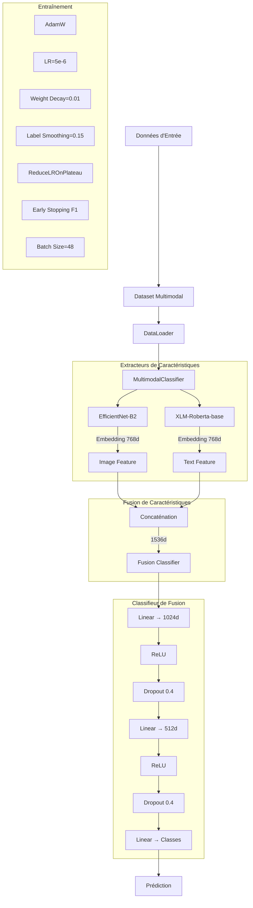

# Modèle MultimodalClassifier

## Vue d'ensemble

Le modèle `MultimodalClassifier` est un système de classification qui combine des données d'images et de texte pour catégoriser des produits dans une base de données Rakuten. Le modèle utilise une stratégie de fusion de caractéristiques (feature fusion) plutôt qu'une fusion à pondération fixe, et emploie une architecture de classification multi-couches pour capturer des relations complexes entre les modalités.

## Diagramme de l'architecture



## Configuration par défaut (`DEFAULT_MULTIMODAL_CONFIG`)

```python
{
    "batch_size": 48,         # Nombre d'échantillons par batch
    "max_epochs": 15,         # Nombre maximal d'epochs (early stopping peut arrêter avant)
    "lr": 5e-6,               # Learning rate de départ (sera ajusté avec ReduceLROnPlateau)
    "patience": 2,            # Nombre d'epochs sans amélioration avant action du scheduler
    "dropout": 0.4,           # Dropout appliqué dans le classifieur (pour éviter l'overfitting)
    "weight_decay": 0.01,     # Régularisation L2 (évite que les poids deviennent trop grands)
    "hidden_size": 512,       # Taille des couches cachées dans le classifieur
    "label_smoothing": 0.15   # Applique un lissage sur les labels pour régulariser
}
```

Ce dictionnaire définit les paramètres clés de l'entraînement et de l'architecture:

* **dropout**: taux de régularisation modéré (0.4) pour prévenir l'overfitting
* **hidden_size**: taille de la couche cachée dans le classifieur (512)
* **label_smoothing**: atténue la surconfiance du modèle (0.15)
* **lr**: taux d'apprentissage adapté aux modèles pré-entraînés (5e-6)
* **weight_decay**: régularisation modérée (0.01) pour améliorer la généralisation

---

## Architecture du modèle (`MultimodalClassifier`)

### 1. Extracteurs de caractéristiques

L'architecture repose sur deux backbones pré-entraînés:

```python
def forward(self, image_tensor, input_ids, attention_mask):
    # Extraction des embeddings d'image (768 dimensions)
    img_feat = self.model_img.get_embedding(image_tensor)  # [B, 768]
    
    # Extraction des embeddings de texte (768 dimensions)
    txt_feat = self.model_txt.get_embedding(input_ids, attention_mask)  # [B, 768]
    
    # Concaténation des caractéristiques
    fused_feat = torch.cat([img_feat, txt_feat], dim=1)  # [B, 1536]
    
    # Classification sur les caractéristiques fusionnées
    logits = self.fusion_classifier(fused_feat)
    
    return logits, {"fused_feat": fused_feat}
```

* **Modèle image**: EfficientNet-B2 fine-tuné (embeddings 768d)
* **Modèle texte**: XLM-RoBerta-base pré-entraîné (embeddings 768d)
* **Fusion par concaténation**: Les embeddings des deux modalités sont concaténés (1536d)

### 2. Classifieur de fusion multicouche

Plutôt que d'utiliser des classifieurs séparés par modalité, cette version adopte une architecture de fusion par concaténation suivie d'un classifieur multicouche:

```python
# Dimensions des caractéristiques 
self.img_output_dim = 768
self.txt_output_dim = 768
fusion_dim = self.img_output_dim + self.txt_output_dim  # 1536

# Paramètres pour le classifieur
hidden_size = self.config.get("hidden_size", 512)
dropout_rate = self.config.get("dropout", 0.4)

# Classifieur de fusion à plusieurs couches
self.fusion_classifier = nn.Sequential(
    nn.Linear(fusion_dim, 1024),      # Projection 1536 → 1024
    nn.ReLU(),                        # Activation non-linéaire
    nn.Dropout(dropout_rate),         # Régularisation
    nn.Linear(1024, hidden_size),     # Projection 1024 → 512
    nn.ReLU(),                        # Activation non-linéaire
    nn.Dropout(dropout_rate),         # Régularisation
    nn.Linear(hidden_size, num_classes)  # Couche de sortie
)
```

Cette architecture:
* Utilise une **concaténation directe** des embeddings (au lieu de la fusion à poids fixes)
* Emploie un réseau plus profond avec **deux couches cachées** (1024 et 512 unités)
* Applique **ReLU** comme activation entre les couches
* Maintient un taux de **Dropout** élevé (0.4) pour éviter le surapprentissage

### 3. Avantages de cette approche

La fusion par concaténation suivie d'un MLP profond présente plusieurs avantages:
* Permet au modèle d'apprendre des interactions complexes entre les modalités
* Ne nécessite pas de définir manuellement des poids de fusion
* Donne au réseau la capacité d'identifier les caractéristiques les plus pertinentes
* Offre une meilleure capacité de généralisation

---

## Gestion des données (`MultimodalDataset`)

### 1. Traitement du texte

```python
# Construction du texte à partir des champs pertinents
designation = str(row.get("designation", "")).strip()
description = str(row.get("description", "")).strip()
text = f"{designation} {description}".strip()

# Prétraitement standardisé
text_clean = self.clean_text(text, config=self.cleaning_config)

# Tokenization pour transformer
encodings = self.tokenizer(
    text_clean,
    truncation=True,
    padding='max_length',
    max_length=self.max_len,
    return_tensors="pt"
)
```

Points clés:
* Concaténation de la désignation et de la description
* Application du nettoyage de texte standard
* Tokenisation avec padding et troncature à 128 tokens

### 2. Traitement robuste des images

```python
try:
    # Construction du chemin de l'image
    image_path = self.os.path.join(
        self.image_dir, 
        f"image_{imageid}_product_{productid}.jpg"
    )
    
    # Chargement et redimensionnement
    image = self.cv2.imread(image_path)
    image = self.cv2.resize(image, (384, 384))
    
    # Augmentation conditionnelle pour les images
    if self.img_transform_config.get("enabled", False):
        image = self.augment_image(image, config=self.img_transform_config)
        
except Exception as e:
    # Fallback en cas d'erreur: image noire
    print(f"Erreur lors du chargement: {str(e)}")
    image = self.np.zeros((384, 384, 3), dtype=self.np.uint8)
```

La gestion d'erreur robuste permet de traiter les cas de:
* Images manquantes
* Images corrompues
* Erreurs lors du chargement ou du prétraitement

L'augmentation d'image est appliquée conditionnellement, avec des techniques comme:
* Rotations aléatoires
* Flips horizontaux
* Variations de luminosité et de contraste

---

## Entraînement et Optimisation

### 1. Architecture d'entraînement (`training_step`, `validation_step`)

```python
def training_step(self, batch, batch_idx):
    # Décomposition du batch
    image_tensor, input_ids, attention_mask, labels = batch
    
    # Forward pass
    logits, _ = self(image_tensor, input_ids, attention_mask)
    
    # Calcul de perte avec label smoothing
    loss = self.loss_fn(logits, labels)
    
    # Mise à jour et logging des métriques
    self.train_acc.update(logits, labels)
    self.train_f1.update(logits, labels)
    self.log('train_loss', loss, on_step=False, on_epoch=True, prog_bar=True)
    self.log('train_f1', self.train_f1.compute(), on_step=False, on_epoch=True, prog_bar=True)
    self.log('train_acc', self.train_acc.compute(), on_step=False, on_epoch=True)
    
    return loss
```

Le label smoothing (0.15) est particulièrement important:
* Évite la surconfiance du modèle
* Améliore la généralisation
* Particulièrement efficace pour les datasets déséquilibrés

### 2. Optimisation avec ReduceLROnPlateau

Le modèle utilise désormais un scheduler ReduceLROnPlateau au lieu d'un scheduler cosinus:

```python
def configure_optimizers(self):
    # Optimiseur avec weight decay pour régularisation
    optimizer = torch.optim.AdamW(
        self.parameters(),
        lr=self.lr,  # taux d'apprentissage initial
        weight_decay=self.config.get("weight_decay", 0.01)  # régularisation L2
    )

    # Scheduler qui réduit le LR quand les performances stagnent
    scheduler = {
        "scheduler": ReduceLROnPlateau(
            optimizer,
            mode="max",  # maximise le F1 score
            factor=0.5,  # divise le LR par 2
            patience=1,  # attends 1 epoch sans amélioration
            threshold=0.01,  # nécessite au moins +1% d'amélioration
            threshold_mode="rel",  # interprète threshold comme relatif
            min_lr=1e-7,  # ne descend pas en dessous de ce LR
            verbose=True  # affiche les changements de LR
        ),
        "monitor": "val_f1",  # métrique surveillée par Lightning
        "interval": "epoch",  # mise à jour après chaque epoch
        "frequency": 1
    }

    return {
        "optimizer": optimizer,
        "lr_scheduler": scheduler
    }
```

Le scheduler ReduceLROnPlateau:
* Réduit le taux d'apprentissage lorsque le F1-score plafonne
* Divise le LR par 2 lorsqu'aucune amélioration relative de 1% n'est observée
* Permet une adaptation dynamique du LR en fonction des performances
* Aide à surmonter les plateaux de la fonction de coût

---

## Système d'entraînement (`MultimodalTrainer`)

### 1. Préparation des données et configuration

```python
# Encodage des labels
self.label_enc = LabelEncoder()
y_train_enc = self.label_enc.fit_transform(y_train)
y_val_enc = self.label_enc.transform(y_val)

# Configuration d'augmentation d'image uniquement
image_augmentation_config = DEFAULT_IMAGE_AUGMENTATION_CONFIG

# Création des datasets avec/sans augmentation
train_dataset = MultimodalDataset(
    df_train, y_train_enc, tokenizer, max_len=128,
    img_transform_config=image_augmentation_config
)

val_dataset = MultimodalDataset(
    df_val, y_val_enc, tokenizer, max_len=128
    # Sans augmentation pour la validation
)
```

### 2. Callbacks et configuration de l'entraînement

```python
callbacks = [
    # Early stopping basé sur F1
    EarlyStopping(
        monitor='val_f1',
        patience=self.config.get("patience", 2),  # arrête si pas d'amélioration après N epochs
        verbose=True,
        mode='max',
        min_delta=0.05  # nécessite +5% de gain pour être considéré comme amélioration
    ),
    
    # Sauvegarde du meilleur modèle
    ModelCheckpoint(
        dirpath=os.path.join(self.model_save_path, "checkpoints"),
        filename='{epoch}-{val_f1:.4f}',
        monitor='val_f1',
        mode='max',
        save_top_k=1,
        verbose=True
    ),
    
    # Monitoring du learning rate
    LearningRateMonitor(logging_interval='epoch')
]

# Entraînement avec configuration complète
trainer = pl.Trainer(
    max_epochs=self.config["max_epochs"],
    callbacks=callbacks,
    logger=csv_logger,
    log_every_n_steps=50,
    gradient_clip_val=1.0,
    default_root_dir=self.model_save_path
)
```

Changements notables:
* Patience de 2 époques pour arrêter l'entraînement si les performances stagnent
* Seuil d'amélioration (min_delta) élevé à 0.05 (5%) pour un early stopping plus strict
* Gradient clipping à 1.0 pour stabiliser l'entraînement avec le nouveau classifieur plus profond

---

## Évaluation et inférence

### Processus d'évaluation

```python
def evaluate(self, df_test, y_test, tokenizer, report_path=None):
    # Préparation des données
    y_test_enc = self.label_enc.transform(y_test)
    test_dataset = MultimodalDataset(
        df_test, y_test_enc, tokenizer, max_len=128
    )
    test_loader = DataLoader(
        test_dataset,
        batch_size=self.config["batch_size"],
        shuffle=False,
        num_workers=4
    )
    
    # Évaluation
    self.model.eval()
    preds, refs = [], []
    
    with torch.no_grad():
        for batch in tqdm(test_loader, desc="Évaluation"):
            img, input_ids, attention_mask, labels = batch
            img = img.to(self.device)
            input_ids = input_ids.to(self.device)
            attention_mask = attention_mask.to(self.device)
            
            logits, _ = self.model(img, input_ids, attention_mask)
            preds.extend(torch.argmax(logits, dim=1).cpu().tolist())
            refs.extend(labels.cpu().tolist())
    
    # Conversion et génération du rapport
    y_true = self.label_enc.inverse_transform(refs)
    y_pred = self.label_enc.inverse_transform(preds)
    report = classification_report(y_true, y_pred, digits=4, zero_division=0)
    
    # Sortie du rapport
    print("\n=== Rapport de classification du modèle multimodal ===")
    print(report)
    
    return report
```

### Prédiction sur un exemple individuel

```python
def predict(self, text, image_path, tokenizer):
    # Prétraitement du texte
    text_clean = clean_text(text)
    encoded = tokenizer(
        text_clean,
        return_tensors="pt",
        truncation=True,
        padding="max_length",
        max_length=128
    )
    input_ids = encoded["input_ids"].to(self.device)
    attention_mask = encoded["attention_mask"].to(self.device)

    # Chargement et prétraitement de l'image
    try:
        image = Image.open(image_path).convert("RGB")
    except Exception as e:
        print(f"Erreur lors du chargement de l'image : {e}")
        image = Image.new("RGB", (384, 384))

    transform = T.Compose([
        T.Resize((384, 384)),
        T.ToTensor(),
        T.Normalize(mean=[0.485, 0.456, 0.406],
                    std=[0.229, 0.224, 0.225])
    ])
    image_tensor = transform(image).unsqueeze(0).to(self.device)

    # Prédiction
    self.model.eval()
    with torch.no_grad():
        logits, _ = self.model(image_tensor, input_ids, attention_mask)
        pred_idx = torch.argmax(logits, dim=1).item()
        pred_label = self.label_enc.inverse_transform([pred_idx])[0]

    return pred_label
```

---

## Fichiers générés

* `model_model.pth`: poids du modèle multimodal entraîné
* `model_meta.pkl`: encoder des labels et configuration
* `metrics/version_*/metrics.csv`: suivi des performances
* `checkpoints/`: meilleurs modèles (via `val_f1`)

---

## Comparaison avec la version précédente

| Aspect | Version précédente | Version actuelle |
|--------|-------------------|-----------------|
| Stratégie de fusion | Fusion à pondération fixe (60% texte, 40% image) | Concaténation des embeddings et MLP |
| Architecture | Classifieurs séparés par modalité | Classifieur unique multicouche |
| Profondeur réseau | 1 couche cachée (512d) | 2 couches cachées (1024d → 512d) |
| Scheduler | Cosine Scheduler avec warmup | ReduceLROnPlateau basé sur F1 |
| Weight decay | 0.1 (fort) | 0.01 (modéré) |
| Learning rate | 2e-6 | 5e-6 |
| Min delta (early stopping) | 0.01 (1%) | 0.05 (5%) |
| **F1 pondéré** | **86.3%** | **87.7%** |

La nouvelle architecture favorise l'apprentissage des interactions complexes entre les modalités texte et image, plutôt que de fixer arbitrairement leur contribution. Cette approche permet une meilleure adaptation aux spécificités du dataset, comme le démontre l'amélioration significative du F1 pondéré (de 86.3% à 87.7%), représentant un gain de 1.4 points de pourcentage.

